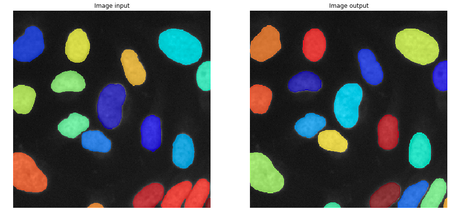

# Kaggle: 2018 Data Science Bowl
Find the nuclei in divergent images to advance medical discovery

Top10%: 358 place

## Installation
    
    #anaconda
    #install anaconda
    #pytorch
    $conda install pytorch torchvision -c pytorch
    $git clone https://github.com/pedrodiamel/pytorchvision.git
    $cd pytorchvision
    $python setup.py install
    $git clone https://github.com/pedrodiamel/datasciencebowl-2018.git
    $cd clone datasciencebowl-2018
    $pip install -r installation.txt

## Download Kaggle dataset
    
    # loader dataset 
    kaggle competitions download -c data-science-bowl-2018    
    # relabel
    $ git clone https://github.com/lopuhin/kaggle-dsbowl-2018-dataset-fixes.git

    #external dataset
    $https://nucleisegmentationbenchmark.weebly.com/

## Visualize result with Visdom

We now support Visdom for real-time loss visualization during training!

To use Visdom in the browser:

    # First install Python server and client 
    pip install visdom
    # Start the server (probably in a screen or tmux)
    python -m visdom.server -env_path runs/visdom/
    # http://localhost:8097/

## How use
### Step 1: Create dataset

    #(1) kaggle dataset
    ./run_createdataset.sh 
    #(2) external dataset
    ./run_createdataset_nuclei.sh

### Step 2: Train

    ./run_train.sh
    
### Step 3: Submission

    ./run_submission.sh

## URLs

- https://towardsdatascience.com/instance-embedding-instance-segmentation-without-proposals-31946a7c53e1
- https://github.com/bodokaiser/piwise/blob/master/piwise/network.py
- https://github.com/lopuhin
- https://github.com/mattmacy/vnet.pytorch/blob/master/train.py
- https://github.com/milesial/Pytorch-UNet/blob/master/myloss.py
- https://github.com/lyakaap
- https://github.com/mdbloice/Augmentor
- https://github.com/kuangliu
- https://github.com/apache/incubator-mxnet/blob/master/python/mxnet/image/image.py

## Others

- curlwget https://chrome.google.com/webstore/detail/curlwget/jmocjfidanebdlinpbcdkcmgdifblncg?hl=es

<!-- 
# BORDER_CONSTANT 	
# BORDER_REPLICATE 	
# BORDER_REFLECT 	
# BORDER_WRAP 	
# BORDER_REFLECT_101 	
# BORDER_TRANSPARENT 	
# BORDER_REFLECT101 	
# BORDER_DEFAULT 	
# BORDER_ISOLATED 	 
-->